### **Getting Started**

1. From the desktop click on the Azure Portal shortcut to sign into the Azure Portal and login to Azure with the username **<inject key="AzureAdUserEmail" />** and Password **<inject key="AzureAdUserPassword" />** and Click on **Sign in**.

    > You can view the Azure Credentials from Environment Details Tab

2. If you see the pop-up  **Stay Signed in?**, click **No**

3. If you see the pop-up **You have free Azure Advisor recommendations!** , close the window to continue the lab. 

4. If a **Welcome to Microsoft Azure** popup window appears, click **Maybe Later** to skip the tour.

## Exercise 1: Create the policy for Enterprise IT

Duration: 60 minutes

In this exercise, you will first create a Management Group for your Azure subscription(s). You will apply several of the built-in Azure Policy definitions to that Management Group to ensure that users stay within the scope of supported services for Enterprise IT. Finally, you will create a new policy initiative defining a multi-resource naming convention and apply that initiative to the Management Group.

### Help references

|    |            |
|----------|:-------------|
| Governance in the Microsoft CAF for Azure | <https://docs.microsoft.com/azure/architecture/cloud-adoption/governance/overview> |
| The Five Disciplines of Cloud Governance | <https://docs.microsoft.com/azure/architecture/cloud-adoption/governance/governance-disciplines> |
| Azure Policy | <https://docs.microsoft.com/azure/azure-policy/azure-policy-introduction> |
| Azure Management Groups | <https://docs.microsoft.com/azure/azure-resource-manager/management-groups-overview> |

### Task 1: Create a Management Group

In this task, you will create a new Management Group and move a subscription into this Management Group. We'll later assign Azure Policy using the Management Group scope, so that it applies automatically to all subscriptions under that scope.

> **Note**: We'll use our own Management Group, if you have permissions you could also use the Tenant Root Management Group.

1. From the Azure portal click the menu icon on the left top corner and select **All services**.

    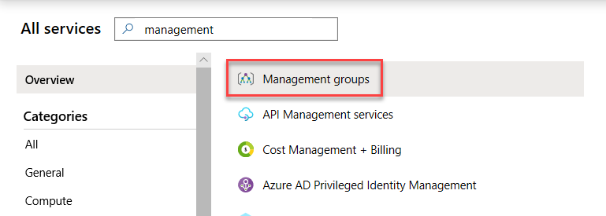

2. Then select **Start using management groups** to launch the **Add management group** blade.

    

    If you already have management groups in place, you can use the **Add management group** button to launch the **Add management group** blade.

    

3. In the **Add management group** blade enter **ERC** for the Management group ID and **Enterprise Ready Cloud** for the Management group display name. Select **Save**. If you have existing management groups, create this as a child of Root and select **Save**. Note that the Management group ID cannot be updated after creation but your display name can be updated later.

    

    > **Note**: If this is the first management group being created, it may take up to 15 minutes for it to complete.

    

4. Select the newly created management group, then select **details**.

    

5. Select **Add Subscription** and for the subscription, choose your subscription from the drop-down list, then select **Save**.

    

### Task 2: Apply the service catalog policy

In this exercise, you will apply one of the built-in Azure Policies to restrict services to the supported list provided by Trey Research.

1. First, we need to build a list of resource types, which will be permitted, and their corresponding resource providers. One way to do this is to use PowerShell. Launch the **Azure Cloud Shell** and select PowerShell. If prompted to create storage, select the **Create storage** button. Accept the prompt for storage.

    

    

2. Run the following script in the shell:

    ```powershell
    $FormatEnumerationLimit = -1
    Get-AzResourceProvider `
        | Select-Object ProviderNamespace, ResourceTypes `
        | Format-List
    ```

3. Review the list, and identify the resource providers and resource types for each of the following:

    ```s
    Resource Name
    --------------------------
    - Resource Group
    - Virtual Machines
    - Disk
    - Network Interface
    - Public IP Address
    - Network Security Group
    - Virtual Networks
    - Virtual Network Gateways
    - ExpressRoute Circuits
    - VPN Gateways
    - Storage Accounts
    - Backup Vault
    - Site Recovery Vault
    - DevTest Labs
    - Key Vault
    - Web Apps
    - SQL Database
    ```

    For example, to find all the resource providers with resource groups as a resource type, a query like the following could be used:

    ```powershell
    Get-AzResourceProvider `
        | Select-Object ProviderNamespace, ResourceTypes `
        | Where-Object { $_.ResourceTypes.ResourceTypeName -like "*resource*groups*" } `
        | Format-List
    ```

    This query shows that the `resourceGroups` resource type is a member of the resource provider `Microsoft.Resources`.

    By altering the `-like` clause, you can filter to easily find the resource providers for the remaining resource types.

    > **Note**: If you do not see the Microsoft.Compute resource provider it is because you have not yet created any compute resources. You can manually register the provider with the following command:

    ```powershell
    Register-AzResourceProvider -ProviderNamespace Microsoft.Compute
    ```

4. In the Azure portal, navigate to **Policy** under **All services**:

    

    > **Hint**: Select the star next to the Policy service to pin it to your Portal navigation. You will visit the Policy service throughout the lab.

5. Select **Definitions**, then **+ Policy definition**.

    

6. In the Policy definition blade, use the following configurations:

    - Definition location: **Enterprise Ready Cloud** (ERC) management group, as created in Task 1.
  
    - Name: **Service catalog**
  
    - Description: **Restrict resource types to those permitted by Enterprise IT**.
  
    - Category: **Create new** > **Service catalog**
  
    - Policy rule: ***Replace the default JSON with the following code:***

    ```json
    {
        "policyRule": {
            "if": {
                "not": {
                    "anyOf": [
                        {
                        "source": "action",
                        "like": "Microsoft.Resources/*"
                        },
                        {
                        "source": "action",
                        "like": "Microsoft.Compute/virtualMachines/*"
                        },
                        {
                        "source": "action",
                        "like": "Microsoft.Compute/virtualMachines/extensions/*"
                        },
                        {
                        "source": "action",
                        "like": "Microsoft.Compute/virtualMachines/locations/*"
                        },
                        {
                        "source": "action",
                        "like": "Microsoft.Compute/virtualMachines/disks/*"
                        },
                        {
                        "source": "action",
                        "like": "Microsoft.Compute/disks/*"
                        },
                        {
                        "source": "action",
                        "like": "Microsoft.Compute/virtualMachines/diagnosticSettings/*"
                        },
                        {
                        "source": "action",
                        "like": "Microsoft.Compute/virtualMachines/metricDefinitions/*"
                        },
                        {
                        "source": "action",
                        "like": "Microsoft.Compute/virtualMachines/images/*"
                        },
                        {
                        "source": "action",
                        "like": "Microsoft.Compute/availabilitySets/*"
                        },
                        {
                        "source": "action",
                        "like": "Microsoft.Network/loadBalancers/*"
                        },
                        {
                        "source": "action",
                        "like": "Microsoft.Network/virtualNetworks/*"
                        },
                        {
                        "source": "action",
                        "like": "Microsoft.Network/networkSecurityGroups/*"
                        },
                        {
                        "source": "action",
                        "like": "Microsoft.Network/publicIPAddresses/*"
                        },
                        {
                        "source": "action",
                        "like": "Microsoft.Network/networkInterfaces/*"
                        },
                        {
                        "source": "action",
                        "like": "Microsoft.Network/operations/*"
                        },
                        {
                        "source": "action",
                        "like": "Microsoft.Network/locations/*"
                        },
                        {
                        "source": "action",
                        "like": "Microsoft.Network/expressRouteCircuits/*"
                        },
                        {
                        "source": "action",
                        "like": "Microsoft.Network/virtualNetworkGateways/*"
                        },
                        {
                        "source": "action",
                        "like": "Microsoft.Network/vpnGateways/*"
                        },
                        {
                        "source": "action",
                        "like": "Microsoft.Network/p2sVpnGateways/*"
                        },
                        {
                        "source": "action",
                        "like": "Microsoft.Storage/*"
                        },
                        {
                        "source": "action",
                        "like": "Microsoft.RecoveryServices/*"
                        },
                        {
                        "source": "action",
                        "like": "Microsoft.DevTestLab/*"
                        },
                        {
                        "source": "action",
                        "like": "Microsoft.KeyVault/*"
                        },
                        {
                        "source": "action",
                        "like": "Microsoft.Web/*"
                        },
                        {
                        "source": "action",
                        "like": "Microsoft.SQL/*"
                        },
                        {
                        "source": "action",
                        "like": "Microsoft.Authorization/*"
                        },
                        {
                        "source": "action",
                        "like": "Microsoft.Insights/*"
                        }
                    ]
                }
            },
            "then" : {
                "effect" : "deny"
            }
        }
    }
    ```

7. Select **Save**.

8. On the ***Policy \- Definitions*** blade, select the **Service catalog** policy definition you just created and then select **Assign** on the *Service catalog* blade.

    

    > **Note**: If you do not see the policy, make sure "Enterprise Ready Cloud" is the selected scope, and not another Management group or an individual subscription.

9. On the ***Service catalog \- Assign policy blade***, specify the following configurations and then select **Assign** to assign your policy definition to your Enterprise Ready Cloud management group:

    - Scope: **ERC**
  
    - Exclusions: **None**
  
    - Policy definition: **Service catalog**
  
    - Assignment name: **Service catalog policy**
  
    - Description: **Restrict resource types to those permitted by Enterprise IT**.
  
    - Policy enforcement: **Enabled**
  
    - Assigned by: **Enterprise IT**

    The assignment form should look like this:

    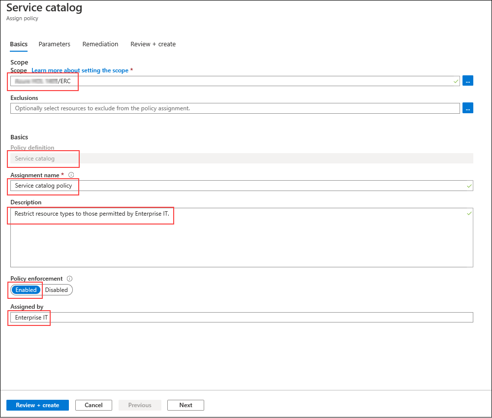

10. Select **Review + Create**. Then select the **Create** button to complete the configuration.

### Task 3: Restrict the creation of ExpressRoute circuits

In this exercise, you will apply another built-in Azure policy to restrict the creation of ExpressRoute circuits. For this policy, we'll use an exclusion scope for the resource group in which Enterprise IT will create the permitted ExpressRoute circuits.

1. First, we'll create the resource group for the exclusion scope. Return to **Home** and select **Resource groups**, then **Add**, and then enter the resource group name **ExpressRouteRG**, select your subscription, and choose a resource group location:

    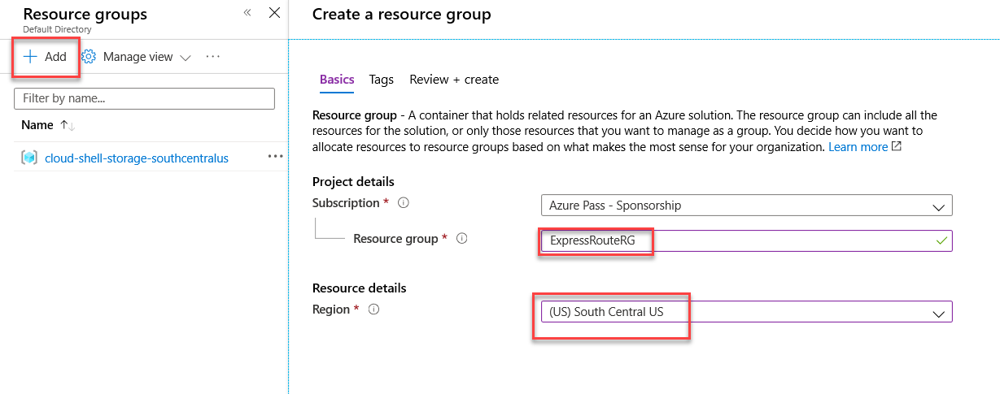

2. Once complete, select **Review + Create** and then **Create**.

3. Return to the **Policy** blade in the Azure portal. Select **Assignments**, then **Assign Policy**. Complete the form as follows:

    - Scope: **Enterprise Ready Cloud** (The management group created earlier.)
  
    - Exclusions: **The resource group created in Step 1 above, ExpressRouteRG. Select the management group, subscription, and resource group**.
  
    - Policy definition: **Not allowed resource types**
  
    - Assignment name: **Block ExpressRoute circuits**
  
    - Description: **Block creating of ExpressRoute circuits, except in the Enterprise IT dedicated ExpressRoute resource group**
  
    - Policy enforcement: **Enabled**
  
    - Assigned by: **Enterprise IT**

    The assignment form should look like this:

    

4. When complete, select **Next** to set the Parameters in the policy assignment.

5. From the drop-down list select the option **expressRouteCircuits**.

6. Select **Review + create**. Your Assign policy screen should look like the below screen shot. Once confirmed select **Create**.

    

### Task 4: Restrict the creation of resources in regions

In this exercise, you will create a new Azure Policy assignment that restricts the regions in which resources can be created in.

1. In the Azure portal, navigate to **Policy**, then select **Assignments**, then **Assign Policy**. Complete the form as follows:

    - Scope: **Enterprise Ready Cloud**
  
    - Exclusions: **None**
  
    - Policy definition: **Allowed locations**
  
    - Assignment name: **Restrict Azure locations**
  
    - Description: **Restrict Azure resources to the list of Azure regions permitted by Enterprise IT**
  
    - Policy enforcement: **Enabled**
  
    - Assigned by: **Enterprise IT**

    The assignment form should look like this:

    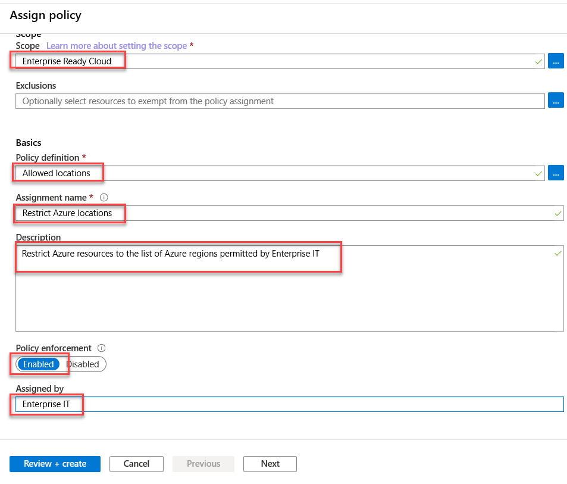

2. When complete, select **Next** to set the Parameters on the policy assignment.

3. Within the Allowed Locations drop-down menu, select the following options:

    - Allowed locations: **East US, West US, North Europe, West Europe, Japan East, Japan West**

4. When complete, select **Review + Create** to review the Assign Policy for the locations and allowed resources. Your results should look like the below screen shot.

    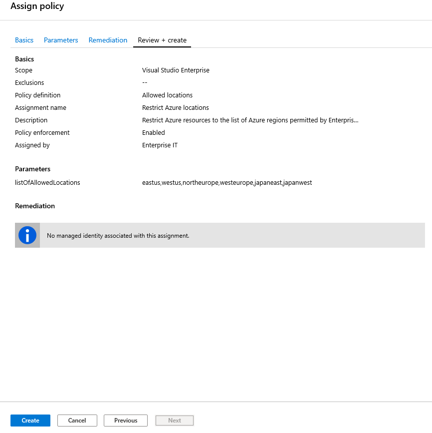

5. Select **Create** to complete the assign policy wizard.

### Task 5: Create and apply a naming convention

In this task, we will define a simple naming convention for Azure resources. We shall simply require that virtual machine names end with ***-vm*** and virtual networks end with ***-vnet***. We will implement this naming convention using a custom policy definition and a policy initiative, assigned at the management group scope.

#### Subtask 1: Create a policy definition <!-- omit in toc -->

First, we will create a generic policy definition that restricts resources of a given type to have a given name suffix. The resource type and name suffix will be specified using parameters.

1. In the Azure portal, open the **Policy** blade, then select **Definitions** and then **+ Policy definition**.

    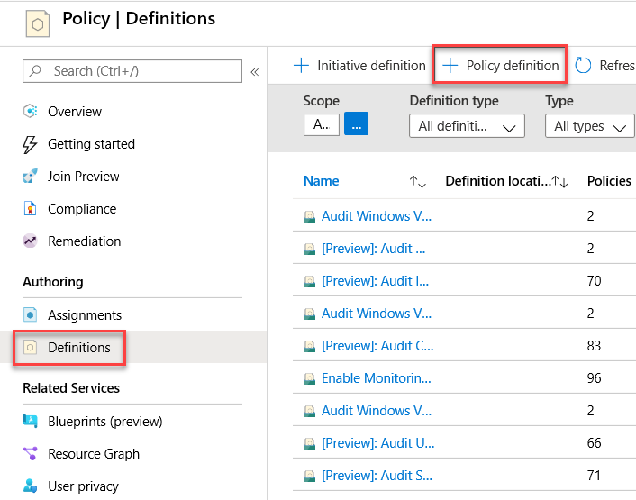

2. Complete the Policy definition form as follows:

    - Definition location: **Enterprise Ready Cloud** (The Management Group created earlier.)
  
    - Name: **Restrict Resource Name Suffix**
  
    - Description: **Restrict resources of a given type to have a name ending with a given suffix. The resource type and suffix are parameterized.**
  
    - Category:  **Create new** > **Naming**
  
    - Policy rule: **Replace with the below JSON**:

    ```json
    {
        "properties": {
            "mode": "all",
            "parameters": {
                "resourceType": {
                    "type": "string",
                    "metadata": {
                        "displayName": "Resource Type",
                        "description": "The resource type for this policy",
                        "strongType": "resourceTypes"
                    }
                },
                "nameSuffix": {
                    "type": "string",
                    "metadata": {
                        "displayName": "Resource Name Suffix",
                        "description": "The suffix that must be appended"
                    }
                }
            },
            "policyRule": {
                "if": {
                    "allof": [
                    {
                        "field": "type",
                        "equals": "[parameters('resourceType')]"
                    },
                    {
                        "not": {
                        "field": "name",
                        "like": "[concat('*-', parameters('nameSuffix'))]"
                        }
                    }
                    ]
                },
                "then": {
                    "effect": "deny"
                }
            }
        }
    }
    ```

3. Once the policy definition is complete, select **Save**.

#### Subtask 2: Create a policy initiative <!-- omit in toc -->

Next, we shall create a policy initiative comprising multiple instances of our policy definition (one per resource type).

1. From the **Policy** blade, on the **Definitions** panel, select **+ Initiative Definition**.

2. Fill in the **Initiative definition** blade as follows (but **do not** select **Save** yet).

    - Definition location: **Enterprise Ready Cloud** (The Management Group created earlier.)
  
    - Name: **Naming Convention**
  
    - Description: **Trey Research resource naming convention**
  
    - Category: **Use Existing** > **Naming**

    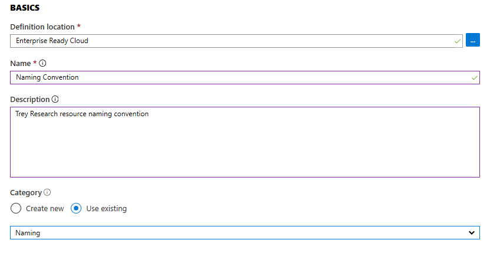

3. Under ***Available Definitions***, find the *Restrict Resource Name Suffix* policy definition created in Step 2.

    

4. Select the policy definition, then select **+Add** to add the Policy Definition to the Policy Initiative.

    

5. Select the resource type and name suffix. In this case, we'll choose **Microsoft.Compute/virtualMachines** as the resource type and **vm** as the name suffix. **Do not select Save**.

    

6. Repeat steps 3-5 above except enter the following values:

      - Resource Type: **Microsoft.Network/virtualNetworks**

      - Resource Name Suffix: **vnet**

    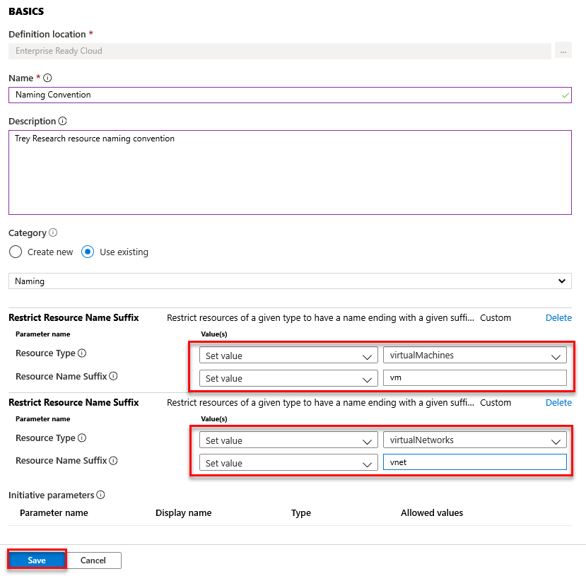

7. Once you've added each resource type, select **Save**.

8. Finally, we will apply the policy initiative across all subscriptions in the Management Group by creating an assignment at the Management group scope. On the **Policy** blade, select **Assignments** and then **Assign Initiative**.

    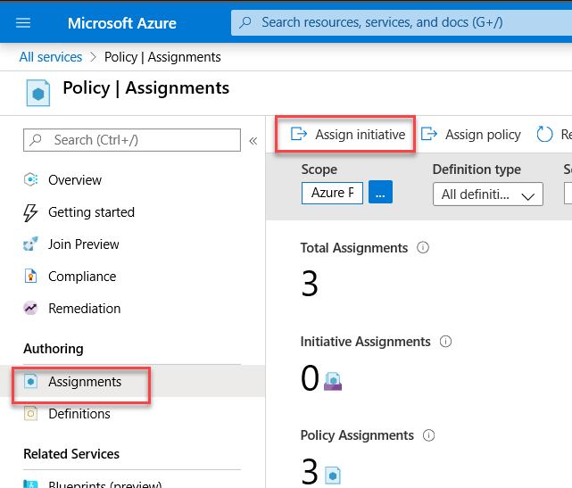

9.  Complete the Assign Initiative form as follows:

    - Scope: **Enterprise Ready Cloud** (The Management Group created earlier.)
  
    - Exclusions: **None**

    - Initiative definition: **Naming Convention** (The initiative definition we just created.)
  
    - Assignment name: **Resource Naming Convention**
  
    - Description: **Enforces company-wide resource naming convention**
  
    - Policy enforcement: **Enabled**
  
    - Assigned by: **Enterprise IT**

    The assignment form should look like this:

    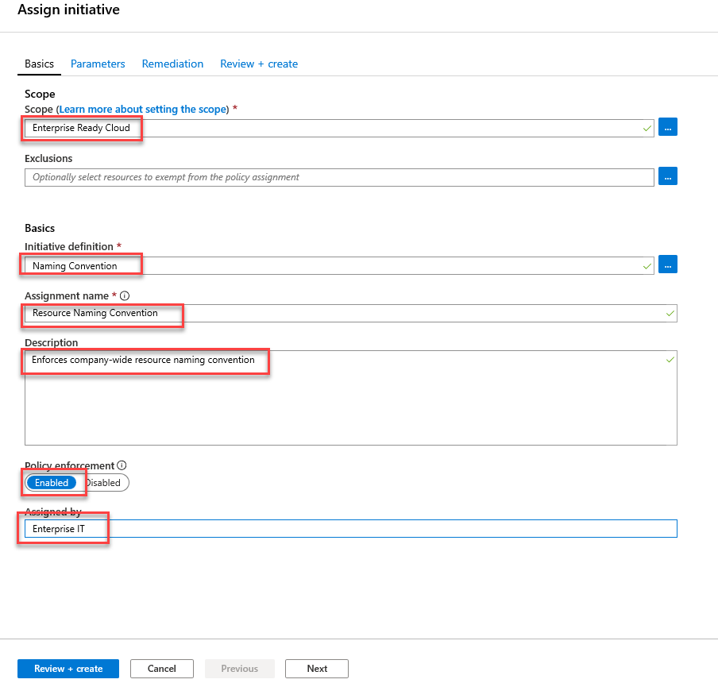

10. When complete, select **Review + Create**, then select **Create** to create the policy initiative assignment.

### Task 6: Test the policies

In this task, you will use the Azure management portal to validate each of the policies created so far and understand how to identify policy events.

#### Subtask 1: Test the service catalog policy <!-- omit in toc -->

1. In the portal's left navigation select **Create a Resource \> Internet of Things \> IoT Hub**.

    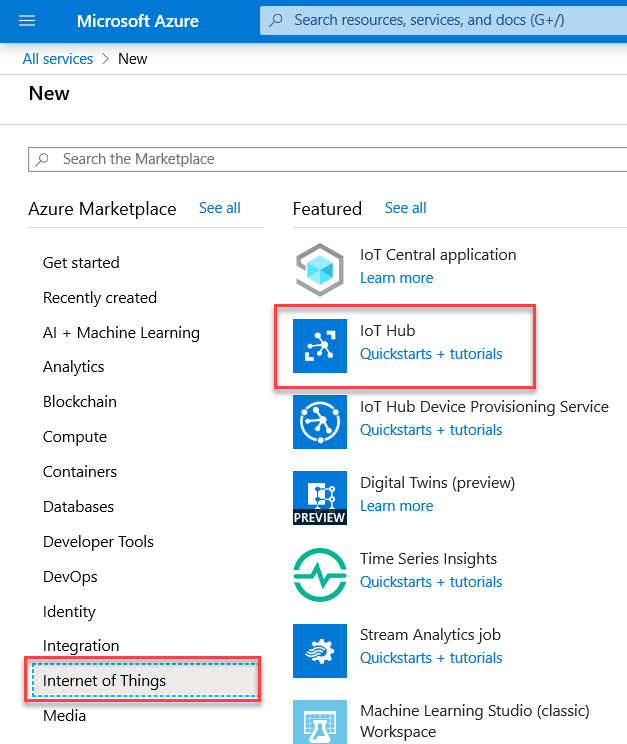

2. Specify a unique name for the IoT Hub and choose the existing **ExpressRouteRG** resource group. Choose a permitted location (we are only testing the Service Catalog policy at this time).

    Once all the settings have been filled in, select **Review + create** followed by **Create**.

    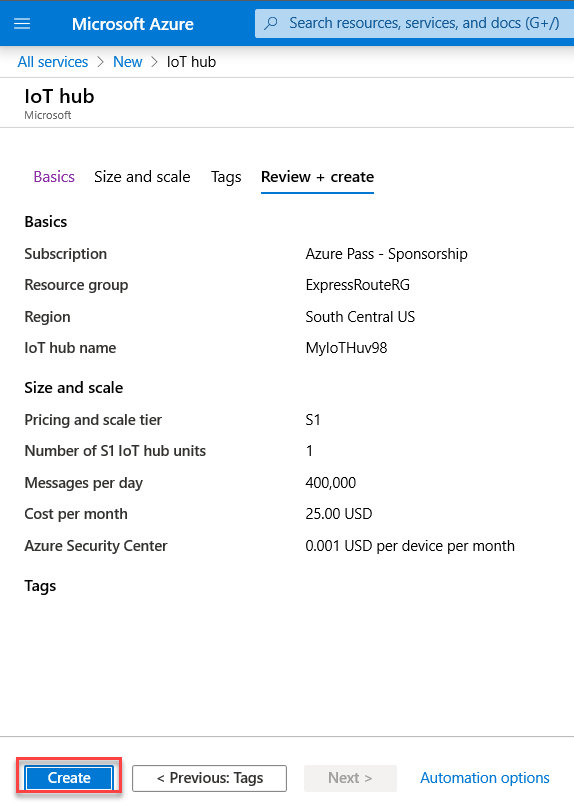

3. The IoT Hub creation blade should show an error. If you select the error message you will see in the activity log that there were policy errors. 

    

#### Subtask 2: Test the ExpressRoute circuit policy <!-- omit in toc -->

1. In the portal's left navigation, select **Create a resource** **\>** **Networking** **\>** **ExpressRoute**.

    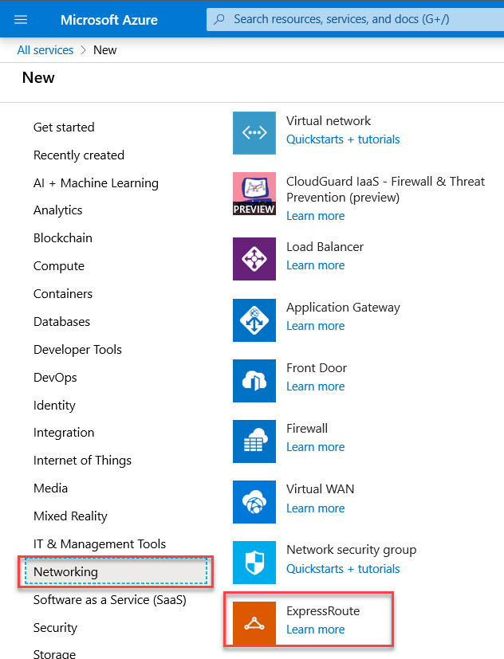

2. Specify the following configuration for the circuit and select **Create**.

    - Create new or import from classic: **Create new**
  
    - Circuit name: **TestCircuit**
  
    - Provider: **AT&T**
  
    - Peering location: **Silicon Valley**
  
    - Bandwidth: **50Mbps**
  
    - SKU: **Standard**
  
    - Billing model: **Unlimited**
  
    - Subscription: **Select your Azure subscription**.
  
    - Resource group: (Create new) **PolicyTestRG**.
   
    - Location: **Any available location in the allowed locations policy including East US, West US, North Europe, West Europe, Japan East, Japan West**.

    

3. As with the Service Catalog policy, you should see an error in the Create ExpressRoute Circuit blade, which when selected shows the error details:

    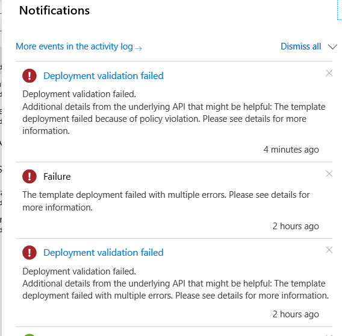


    > **Note**: If you created a new resource group in the previous step, you will see that the resource group has been created even though the deployment of the resource failed. This is because the policy that was created to restrict the creation of ExpressRoute circuits specifically targets that Azure resource type and a resource group is another distinct resource type.

#### Subtask 3: Test the resource location policy <!-- omit in toc -->

1. Testing the resource location policy follows a similar pattern. You would attempt to create a permitted resource, with a permitted name, but in a non-permitted region. For example, you can attempt to create a virtual network within the **PolicyTestRG** resource group named **erc-vnet** in **South Central US**. This should be rejected by the **Restrict Azure locations** policy.

    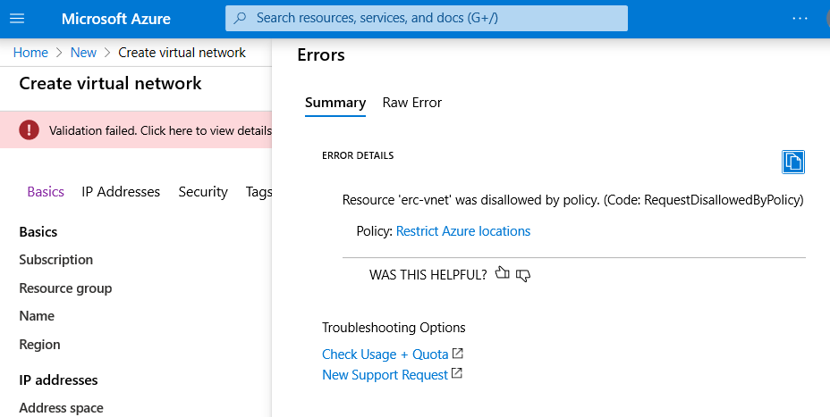

2. To test further, change the region to a permitted location (e.g. **East US**) and try again. This time, the virtual network should be created without issue.

    > **Note**: Recall that an initiative assignment was made earlier to deny the creation of resources that do not meet the organizational naming conventions. If you had attempted to create a virtual networking without `-vnet` in its name, the creation of the resource would have been denied by the initiative assignment and its associated configuration.

#### Subtask 4: Test the naming convention policy <!-- omit in toc -->

1. Attempt to create a permitted resource, in a permitted location, with a non-permitted name. For example, create a virtual network within the **PolicyTestRG** resource group named **erc-network** in the **East US** region. This should be rejected by the **Resource Naming Convention** policy.

2. To test further, change to a permitted name (e.g. **erc-network-vnet**) and try again---this time, the virtual network should be created without issue.
