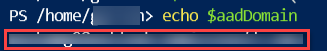
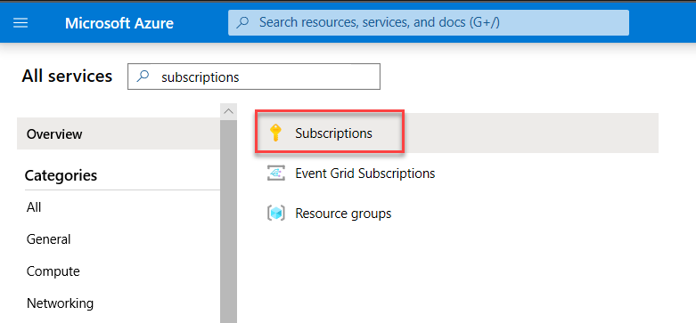
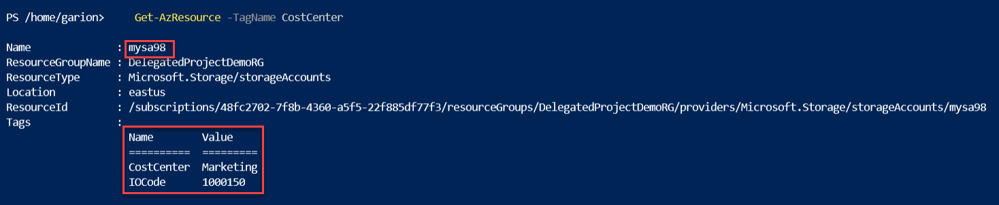
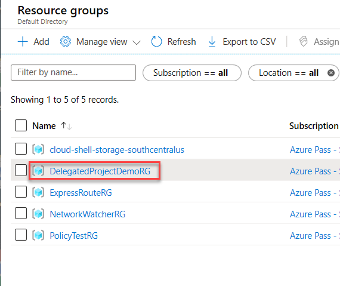

## Exercise 2: Configure delegated permissions

Duration: 60 minutes

In this exercise, you will configure delegated permissions for users in the Trey Research business unit. You will use the Azure AD Graph commands in the Azure CLI to work with users and groups and you will extend a PowerShell script to automatically provision a limited access user with the configuration of the subscription.

### Help references

|                                                              |                                                                                                             |
|--------------------------------------------------------------|:-----------------------------------------------------------------------------------------------------------|
| Add new users to Active Directory                            | <https://docs.microsoft.com/azure/active-directory/add-users-azure-active-directory>                        |
| How Subscriptions are associated with Azure AD               | <https://docs.microsoft.com/azure/active-directory/active-directory-how-subscriptions-associated-directory> |
| Managing Azure AD Security Groups                            | <https://docs.microsoft.com/azure/active-directory/active-directory-groups-create-azure-portal>             |
| Role Based Access Control                                    | <https://docs.microsoft.com/azure/active-directory/role-based-access-control-configure>                     |
| Manage RBAC with PowerShell                                  | <https://docs.microsoft.com/azure/active-directory/role-based-access-control-manage-access-powershell>      |
| Manage Azure Active Directory Graph entities needed for RBAC | <https://docs.microsoft.com/cli/azure/ad?view=azure-cli-latest>                                             |

### Task 1: Create groups in Azure AD for delegation

In this task, you will create two groups in Azure AD that you will use for testing delegated access control. In the next task, users will be created that will be added to these new security groups.

1. Launch the Azure Cloud Shell and select **PowerShell** if prompted. If prompted to create storage, select the **Create storage** button.

    

    

    > **Note**: In the following commands, we will use the Azure CLI to provision users and groups in Azure AD. The PowerShell Cloud Shell gives us access to *both* the Azure PowerShell module (Az) and the Azure CLI.

2. In the shell, execute the following script to create two new security groups:

    ```s
    az ad group create --display-name "BU-Electronics-Admins" --mail-nickname "BU-Electronics-Admins"
    az ad group create --display-name "BU-Electronics-Users" --mail-nickname "BU-Electronics-Users"
    ```

### Task 2: Create user accounts in Azure AD for delegation

In this task, you will create two user accounts in Azure AD that you will use for testing delegated access control.

1. Execute the following script to find out the name of your Azure AD tenant (this will be needed in the next step) and store it in a variable. Be sure to make note of it in Notepad as well. It will be needed in the next task.

    ```s
    $aadDomain = (az ad signed-in-user show --query userPrincipalName -o tsv).Split("@")[1]
    echo $aadDomain
    ```

    

2. Create the first user, **Electronics Admin** and add the user to the **BU-Electronics-Admins** security group.

    ```s
    az ad user create --display-name "Electronics Admin" --password "demo@pass123" --user-principal-name "ElectronicsAdmin@$aadDomain"
    $memberId = (az ad user show --upn-or-object-id "ElectronicsAdmin@$aadDomain" --query objectId -o tsv)
    az ad group member add --group "BU-Electronics-Admins" --member-id $memberId
    ```

3. Next, create the user **Electronics User** and add the user to the **BU-Electronics-Users** security group.

    ```s
    az ad user create --display-name "Electronics User" --password "demo@pass123" --user-principal-name "ElectronicsUser@$aadDomain"
    $memberId = (az ad user show --upn-or-object-id "ElectronicsUser@$aadDomain" --query objectId -o tsv)
    az ad group member add --group "BU-Electronics-Users" --member-id $memberId
    ```

### Task 3: Enable a business unit administrator for the subscription

In this task, you will update a script to automatically add a user to the contributor role of the subscription.

1. Create a new script in the Cloud Shell using **code** by running the following:

    ```s
    code
    ```

2. Add the following code to script. This code will retrieve the object ID for the Active Directory group passed in and assign the group to the Contributor role on the subscription.

    ```powershell
    param([string]$SubscriptionId, [string]$AdGroupName)

    Select-AzSubscription -SubscriptionId $SubscriptionId

    $scope = "/subscriptions/$SubscriptionId"

    $groupObjectId = (Get-AzADGroup -SearchString $AdGroupName).Id

    Write-Output "Adding group to contributor role"

    New-AzRoleAssignment -Scope $scope `
                            -RoleDefinitionName "Contributor" `
                            -ObjectId $groupObjectId
    ```

    This code will add an Azure AD security group to the contributor role at the subscription scope.

3. Save the file as **ConfigureSubscription.ps1** by selecting **Save** in under the ellipsis (...).

    

4. Close **code** by selecting **Close Editor** under the ellipsis (...).

5. Create a local variable in the **Console** containing your Subscription ID (you can copy your subscription ID from the Azure portal, or obtain it using `Get-AzSubscription`). In this example, we will obtain is using the referenced cmdlet.

    ```powershell
    $SubscriptionId = (Get-AzSubscription).SubscriptionId
    ```

    > **Note**: If your account has access to multiple Azure subscriptions you may need to alter the command to target the proper subscription using the `-SubscriptionId` or `-SubscriptionName` parameter with the `Get-AzSubscription` cmdlet.

6. Execute the script passing in the `-SubscriptionID` and `-AdGroupName` parameters:

    ```powershell
    . $HOME\ConfigureSubscription.ps1 -SubscriptionId $SubscriptionId -AdGroupName "BU-Electronics-Admins"
    ```

7. In a different type of browser, or in an InPrivate or Incognito mode window in your current browser navigate to the Azure management portal in a browser at <http://portal.azure.com>, and sign in using the **ElectronicsAdmin** credentials created earlier and shown below. Be sure to include your tenant name in the username. 

    - Username: **electronicsadmin@[the tenant name you noted earlier]**

    - Password: **demo@pass123**

    > **Note**: You may be prompted to configure a method of resetting your account. You may be able to skip this but if not, you can choose either a phone call or email.

8. Select **All services** then search for and select **Subscriptions**.

    

9.  Select the name of the subscription you have been using.

10. Select the **Access control (IAM)** on the left and select the **Role assignments** tab:

    

11. You should see the **BU-Electronics-Admins** group assigned to the contributor role.

    

    > **Note**: Users in the Contributor role scoped at the subscription have full access to all the resources within the subscription but cannot grant access to others or change policies on the subscription.

### Task 4: Enable project-based delegation and chargeback with tags

In this task, you will create a script that will create a new resource group, assign 'Owner' rights over the resource group to a given AD group, and then apply a policy to enforce an 'IOCode' and 'CostCenter' tag with a given value.

1. Login to the Azure portal at <https://portal.azure.com> using your normal credentials (not the **ElectronicsAdmin** account).

2. Launch the Azure Cloud Shell and select PowerShell if prompted. If prompted to create storage, select the **Create storage** button.

    

    

3. Create a new script called **CreateProjectResourceGroup.ps1** and open it in the Cloud Shell using **code** by entering the following:

    ```s
    touch CreateProjectResourceGroup.ps1; code CreateProjectResourceGroup.ps1
    ```

4. Add the following code to the script, and **Save** the file by selecting **Save** under the ellipse (...):

    ```powershell
    param(
        [string]$SubscriptionId,
        [string]$ResourceGroupName,
        [String]$Location,
        [String]$IOCode,
        [String]$CostCenter,
        [string]$AdGroupName
    )

    Select-AzSubscription -SubscriptionId $SubscriptionId

    # Create resource group
    New-AzResourceGroup -Name $ResourceGroupName -Location $Location 

    $scope = "/subscriptions/$subscriptionId/resourceGroups/$resourceGroupName"

    # Assign Owner role to given group
    $groupObjectId = (Get-AzADGroup -SearchString $AdGroupName).Id

    New-AzRoleAssignment -Scope $scope `
                            -RoleDefinitionName "Owner" `
                            -ObjectId $groupObjectId

    # Assign policy to apply IOCode tag
    $definition = Get-AzPolicyDefinition | where {$_.Properties.displayName -eq "Append a tag and its value to resources"}

    $parameters = @{
        tagName = 'IOCode'
        tagValue = $IOCode
        }

    New-AzPolicyAssignment -Name "AppendIOCode" `
                                -Scope $scope `
                                -DisplayName "Append IO Code" `
                                -PolicyDefinition $definition `
                                -PolicyParameterObject $parameters

    # Assign policy to apply CostCenter tag
    $definition = Get-AzPolicyDefinition | where {$_.Properties.displayName -eq "Append a tag and its value to resources"}

    $parameters = @{
        tagName = 'CostCenter'
        tagValue = $CostCenter
        }

    New-AzPolicyAssignment -Name "AppendCostCenter" `
                                -Scope $scope `
                                -DisplayName "Append Cost Center" `
                                -PolicyDefinition $definition `
                                -PolicyParameterObject $parameters
    ```

    This PowerShell script creates a new resource group in the specified region. It then assigns the group to the owner role definition just for the resource group. It will allow users in the group to have full ownership of resources within the resource group only. This code applies a built-in policy to append a tag with the name **IOCode** and another tag for **CostCenter** and then applies the given tag value to any resource created in the resource group.

    > **Note**: The **Apply tag and its default value** policy applies tags to the resources included in the assignment scope, but it does not apply any tags to the parent resource group for those resources. It is important to understand that in Azure, tags are not automatically inherited from a parent object without additional configuration.

5. Close **code** by selecting **Close Editor** under the ellipsis (...).

6. In the **Console** pane, create a new variable called **\$location**, and specify a region name to deploy to the resource group to. This location must be one of the supported regions in your previously created policy.

    ```powershell
    $location = "East US"
    ```

7. In the **Console** pane, create a new variable called **\$resourceGroupName**, and specify the value as **DelegatedProjectDemRG**. Also, make sure you create a **\$SubscriptionId** variable as you did earlier.

    ```powershell
    $resourceGroupName = "DelegatedProjectDemoRG"
    $SubscriptionId = (Get-AzSubscription).SubscriptionId
    ```

    > **Note**: If your account has access to multiple Azure subscriptions you may need to alter the command to target the proper subscription using the `-SubscriptionId` or `-SubscriptionName` parameter with the `Get-AzSubscription` cmdlet.
    >
    > **Note**: If you receive an error similar to the following `Get-AzSubscription : The access token expiry UTC time '4/24/2019 3:31:22 PM' is earlier than current UTC time '4/24/2019 3:44:34 PM'.` you can re-authenticate to your Azure account using the `Connect-AzAccount` cmdlet.

8. In the **Console** pane, execute the following command to create a new resource group with delegated permissions and IO Code and Cost Center policies scoped to the resource group.

    ```powershell
    . $HOME\CreateProjectResourceGroup.ps1 -SubscriptionId $SubscriptionId -ResourceGroupName $resourceGroupName -Location $location -IOCode "1000150" -CostCenter "Marketing" -AdGroupName "BU-Electronics-Admins"
    ```

9. Create a new storage account in the resource group (choose a unique name) to validate the ioCode tag was applied (replace *uniquestorageaccount* with a unique value).

    ```powershell
    New-AzStorageAccount -ResourceGroupName $resourceGroupName `
        -Name "uniquestorageaccount" `
        -SkuName Standard_LRS `
        -Location $location
    ```

10. You can now search for resources with the applied tags to verify the policy has been applied. Execute the following PowerShell commands to validate that the storage account has been tagged.

    ```powershell
    Get-AzResource -TagName IOCode
    Get-AzResource -TagName CostCenter
    ```

    In the output, you should see your storage account returned for each tag.

    

    > **Note**: It can take several minutes for the policies assignments that were made in the previous step to take effect. If you find that the tags were not automatically applied, delete the storage account and recreate it. After recreating it, you should see the tags applied with the `Get-AzResource` cmdlet.

11. Switch back to the Azure Management portal using the **ElectronicsAdmin** credentials.

    - Username: **electronicsadmin@[the tenant name you noted earlier]**

    - Password: **demo@pass123**

12. Select **Resource Groups**.

13. Select the **DelegatedProjectDemoRG** resource group.

    

14. Select **Access control (IAM)**, then select the **Role assignments** tab. Note that the BU-Electronics-Admins security group is set as an Owner of the resource group.

    

15. Select **+ Add** followed by **Add role assignment**.

    

16. Select **Owner** for the Role.

    

17. Select the **BU-Electronics-Users** group and select **Save** to add the group to the role.

    

Now both the security groups **BU-Electronics-Admins** and **BU-Electronics-Users** are both Owners of at the **DelegatedProjectDemoRG** scope and members of each security group have full control over the resource group and all its resources.
