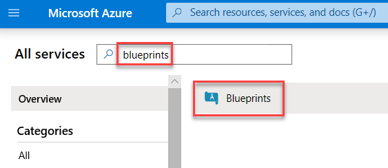
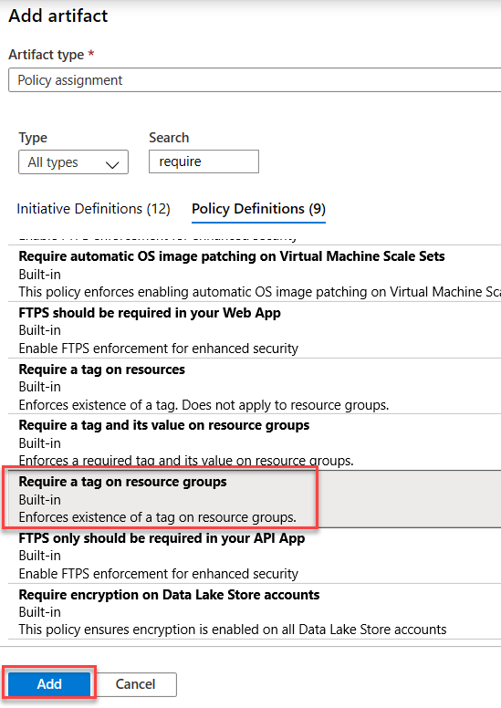
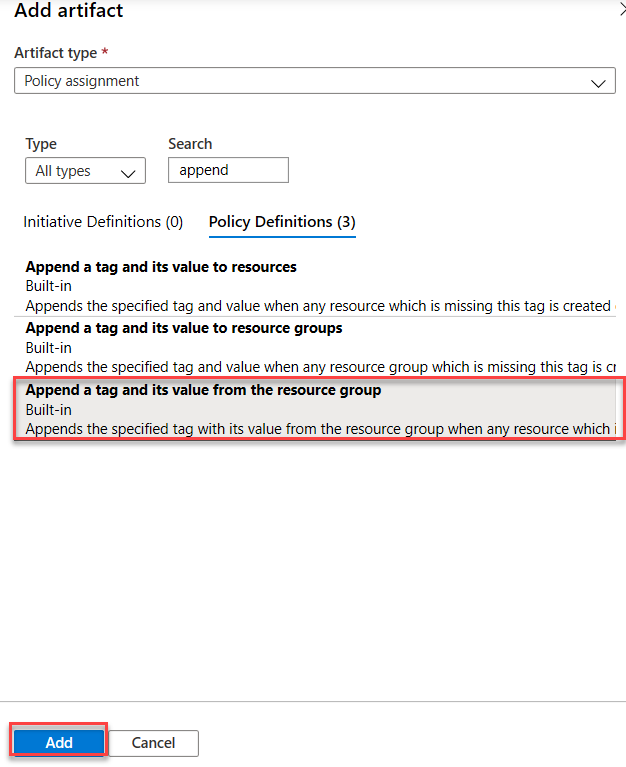
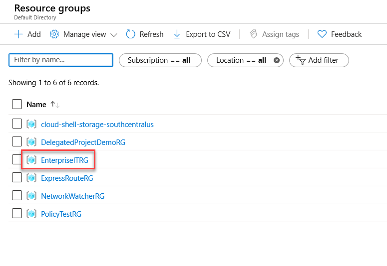
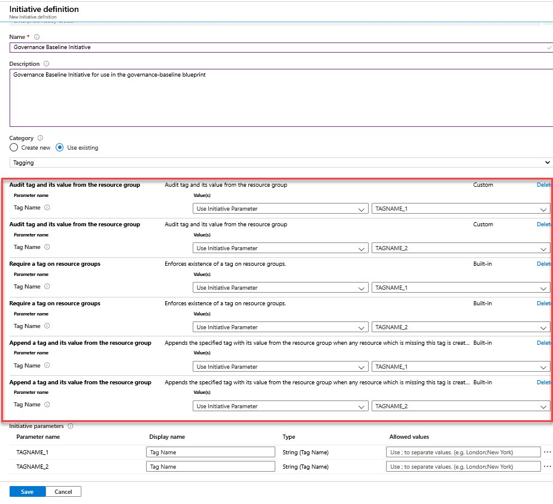

## Exercise 3: Use Azure Blueprints to govern your Azure environment

Duration: 75 minutes

In this exercise you will create an Azure Blueprint at the Management Group scope to model your Azure environment using Azure Blueprint artifacts such as resource groups, Azure Resource Manager templates, resource locks, Azure Policy, and Azure RBAC.

### Help references

|                                                                         |                                                                                              |
|-------------------------------------------------------------------------|:--------------------------------------------------------------------------------------------|
| Overview of the Azure Blueprints service                                | <https://docs.microsoft.com/azure/governance/blueprints/overview>                            |
| Understand resource locking in Azure Blueprints                         | <https://docs.microsoft.com/azure/governance/blueprints/concepts/resource-locking>           |
| Azure Resource Manager overview                                         | <https://docs.microsoft.com/azure/azure-resource-manager/resource-group-overview>            |
| Understand the structure and syntax of Azure Resource Manager templates | <https://docs.microsoft.com/azure/azure-resource-manager/resource-group-authoring-templates> |
| Get compliance data of Azure resources                                  | <https://docs.microsoft.com/azure/governance/policy/how-to/get-compliance-data>              |

### Task 1: Create a new Azure Blueprint

In this task, you will create a new Azure Blueprint and add several artifacts to the blueprint. You will then save a draft of the blueprint.

1. Sign out and sign back into the portal with your regular global admin credentials. 

2. In the Azure portal at <https://portal.azure.com> navigate to the Azure Blueprints service by selecting **All services**, searching for **Blueprints**, and then selecting **Blueprints**.

    

    > **Tip**: You can pin the Blueprints service to the portal navigation by selecting the star next to **Blueprints**.

3. In the **Getting started** blade, select **Create** under **Create a blueprint**. 

    

4. Select **Start with a blank blueprint**.

    

5. In the **Create blueprint** blade, enter the following to complete the form:

    - Blueprint name: **governance-baseline**

    - Blueprint description: **The governance-baseline blueprint will be applied to all subscriptions within the ERC management group.**
  
    - Definition location: **Enterprise Ready Cloud** management group

    

6. Select **Next : Artifacts >>**.

7. Select **+ Add artifact...** and then select **Policy assignment** for the **Artifact type** in the **Add artifact** blade.

    

8. Select the **Require a tag on resource groups** policy and select **Add**.

    

    > **Note**: In Exercise 2, Azure Policy was used to automatically tag resources as they were created in a resource group but recall that any tags on the resource group itself were not inherited. Through this blueprint, we will ensure that the *IOCode* and *CostCenter* tags are enforced on each resource group that is created *and* that the tags that are set on the resource group are automatically inherited by any child resources.

9.  Select **+ Add artifact...** and then select **Policy assignment** for the **Artifact type** in the **Add artifact** blade.

    

10. Select the **Require a tag on resource groups** policy and select **Add**.

    

    > **Note**: We need to add two of the same policy definition so we can enforce each tag for *IOCode* and *CostCenter*.

11. Select **+ Add artifact...** and then select **Policy assignment** for the **Artifact type** in the **Add artifact** blade.

    

12. Select the **Append a tag and its value from the resource group** policy and select **Add**.

    

13. Select **+ Add artifact...** and then select **Policy assignment** for the **Artifact type** in the **Add artifact** blade.

    

14. Select the **Append a tag and its value from the resource group** policy and select **Add**.

    

    > **Note**: We need to add two of the same policy definition so we can ensure each tag for *IOCode* and *CostCenter* is replicated from the resource group to any child resources.

15. Select **+ Add artifact...** and then select **Azure Resource Manager template (Subscription)** for the **Artifact type** in the **Add artifact** blade.

    

16. Complete the form with the following information. This resource group will be used to demonstrate that the policy enacted in our blueprint is working by creating a resource group and then creating a storage account within that resource group.

    - Artifact display name: **BU-RG**

17. In the Template field, paste the following template and select **Add**:

    ```json
    {
        "$schema": "https://schema.management.azure.com/schemas/2018-05-01/subscriptionDeploymentTemplate.json#",
        "contentVersion": "1.0.0.1",
        "parameters": {
            "rgName": {
                "type": "string",
                "metadata": {
                    "description": "The name of the resource group"
                }
            },
            "rgLocation": {
                "type": "string",
                "defaultValue": "eastus",
                "allowedValues": [
                    "eastus",
                    "westus",
                    "northeurope",
                    "westeurope",
                    "japanwest",
                    "japaneast"
                ],
                "metadata": {
                    "description": "The location of the resource group"
                }
            },
            "storagePrefix": {
                "type": "string",
                "maxLength": 11,
                "metadata": {
                    "description": "The prefix for the name of the storage account which will have a unique string appended to it"
                }
            },
            "IOCode": { 
                "type": "string",
                "metadata": {
                    "description": "The value of the IOCode tag that will be applied to the resource group"
                }
            },
            "CostCenter": { 
                "type": "string",
                "metadata": {
                    "description": "The value of the CostCenter tag that will be applied to the resource group"
                }
            }
        },
        "variables": {
            "storageName": "[concat(parameters('storagePrefix'), uniqueString(subscription().id, parameters('rgName')))]"
        },
        "resources": [
            {
                "type": "Microsoft.Resources/resourceGroups",
                "apiVersion": "2018-05-01",
                "location": "[parameters('rgLocation')]",
                "name": "[parameters('rgName')]",
                "tags": {
                    "IOCode": "[parameters('IOCode')]",
                    "CostCenter": "[parameters('CostCenter')]"
                },
                "properties": {}
            },
            {
                "type": "Microsoft.Resources/deployments",
                "apiVersion": "2018-05-01",
                "name": "storageDeployment",
                "resourceGroup": "[parameters('rgName')]",
                "dependsOn": [
                    "[resourceId('Microsoft.Resources/resourceGroups/', parameters('rgName'))]"
                ],
                "properties": {
                    "mode": "Incremental",
                    "template": {
                        "$schema": "https://schema.management.azure.com/schemas/2015-01-01/deploymentTemplate.json#",
                        "contentVersion": "1.0.0.0",
                        "parameters": {},
                        "variables": {},
                        "resources": [
                            {
                                "type": "Microsoft.Storage/storageAccounts",
                                "apiVersion": "2017-10-01",
                                "name": "[variables('storageName')]",
                                "location": "[parameters('rgLocation')]",
                                "kind": "StorageV2",
                                "sku": {
                                    "name": "Standard_LRS"
                                }
                            }
                        ],
                        "outputs": {}
                    }
                }
            }
        ],
        "outputs": {}
    }
    ```

    

    > **Note**: The template parameters will be determined at the time the blueprint is assigned. This allows us flexibility if we need to make a blueprint assignment multiple times and have it maintain a dynamic nature.

18. Save the blueprint as a draft by selecting the **Save Draft** button.

    

### Task 2: Publish a draft blueprint and assign it

In this task, you will publish the previously created blueprint and assign the blueprint to your subscription.

1. In the portal, select **Blueprint definitions** and then the **governance-baseline** blueprint created in the previous step.

    

2. Select **Publish blueprint**.

    

3. Enter a version number (for example *1.0*) in the **Version** field and select **Publish**.

4. Select **Assign blueprint**.

    

5. In the **Assign blueprint** blade, select your target **Subscription**, location (making sure to select a location your previous policy allows such as **East US**), and then scroll down to the **Artifact parameters** section of the blade.

    

6. Complete the **Artifact parameters** section of the blade with the following:

    - Append tag and its value from the resource group - Tag Name: **IOCode**
  
    - Append tag and its value from the resource group - Tag Name: **CostCenter**
  
    - BU-RG
  
      - rgName: **EnterpriseITRG**
  
      - rgLocation: **eastus**
  
      - storagePrefix: **treyrsrch**
  
      - IOCode: **1000151**
  
      - CostCenter: **Enterprise IT**
  
    - Require specified tag on resource groups - Tag Name: **IOCode**
  
    - Require specified tag on resource groups - Tag Name: **CostCenter**

    

7. Select **Assign**. You will see a notification that the blueprint assignment is being created.

    

8. You will receive an error that the blueprint assignment cannot be made as the blueprint resource is disallowed by the *Service catalog* policy that was created in Exercise 1.

### Task 3: Update the Service catalog policy to allow blueprint assignments

In this task, you will update an existing policy that blocks the deployment of Blueprint assignments to your Azure subscriptions located in the Enterprise Ready Cloud (ERC) management group.

1. In the Azure portal, navigate to the Policy service.

2. Select the **Definitions** blade followed by the **Service catalog** policy.

    

3. Select **Edit definition**.

    

4. Add a comma after  `Microsoft.Insights` source and select **Enter**. Add the following then select **Save**.

    ```json
    {
        "source": "action",
        "like": "Microsoft.Blueprint/blueprintAssignments/*"
    }
    ```

    

### Task 4: Assign a blueprint

In this task you will make a blueprint assignment of a published blueprint to an Azure subscription.

1. In the Azure portal, navigate to the Blueprints service.

2. Select **Blueprint definitions** and then the **governance-baseline** blueprint created in the previous task.

    

3. Select **Assign blueprint**.

    

4. In the **Assign blueprint** blade, select your target **Subscription**, location (making sure to select a location your previous policy allows such as East US), and then scroll down to the **Artifact parameters** section of the blade.

    

5. Complete the **Artifact parameters** section of the blade with the following:

    - Append tag and its value from the resource group - Tag Name: **IOCode**

    - Append tag and its value from the resource group - Tag Name: **CostCenter**

    - BU-RG
  
      - rgName: **EnterpriseITRG**
  
      - rgLocation: **eastus**
  
      - storagePrefix: **treyrsrch**
  
      - IOCode: **1000151**
  
      - CostCenter: **Enterprise IT**
  
    - Require specified tag on resource groups - Tag Name: **IOCode**
  
    - Require specified tag on resource groups - Tag Name: **CostCenter**

    

6. Select **Assign**. You will see a notification that the blueprint assignment is being created.

    

7. Now that the *Service catalog* policy has been updated, the blueprint assignment will be successful.

    

8. Select the **Blueprint assignment succeeded** link in the notification to view the status of the blueprint.

### Task 5: Verify blueprint assignment and resource creation

In this task you will verify that the resource artifacts from the blueprint assignment have been created and that the policies deployed as a part of the assignment are operating as designed.

1. In the Azure portal, select **Resource groups** followed by the **EnterpriseITRG** resource group.

    

2. Note that both the *IOCode* and *CostCenter* tags have been applied to the resource group. The application of these tags was done through the Azure Resource Manager template that was an artifact within the blueprint assignment.

    

3. Next, select the storage account prefixed with *treyrsrch*.

4. In the **Overview** pane, note the tags for *IOCode* and *CostCenter* have been inherited from the parent resource group. These tags were not a part of the Azure Resource Manager template and are a product of the Azure Policy artifacts in the blueprint.

    

### Task 6: Editing blueprints

In this task, you will edit the existing blueprint to add an additional policy to audit for the compliance of the resource group tag(s) matching the tags of child resources and publish the updated blueprint to your Azure subscription.

#### Subtask 1: Create a policy definition <!-- omit in toc -->

The policy required to audit for the match of a given tag name and value is a custom policy. To leverage the policy within a blueprint, we first need to create the policy at the same scope as our blueprint, which in this case is the Enterprise Ready Cloud (ERC) management group.

1. In the Azure portal, navigate to the Policy service.

2. Select **Definitions** and then select **+ Policy definition**.

    

3. In the **New Policy definition** form, enter the following values:

    - Definition location: The **Enterprise Ready Cloud** management group.
  
    - Name: **Audit tag and its value from the resource group**
  
    - Description: **Audit tag and its value from the resource group**

    - Category: **(Create new) Tagging**
  
    - Policy rule: **Use the definition in the following code block**:

    ```json
    {
        "mode": "Indexed",
        "parameters": {
            "tagName": {
                "type": "String",
                "metadata": {
                    "displayName": "Tag Name",
                    "description": "Name of the tag, such as 'environment'"
                }
            }
        },
        "policyRule": {
            "if": {
                "not": {
                    "field": "[concat('tags[', parameters('tagName'), ']')]",
                    "equals": "[resourceGroup().tags[parameters('tagName')]]"
                }
            },
            "then": {
                "effect": "audit"
            }
        }
    }
    ```

    

4. Select **Save**.

#### Subtask 2: Create a policy initiative 

To simplify the management of our blueprint, next we will create a new initiative definition for use in the existing governance-baseline blueprint.

1. Select **Definitions** followed by **+ Initiative definition**.

    

2. In the **New Initiative definition** form, enter the following values:

    - Definition location: The **Enterprise Ready Cloud** management group.
  
    - Name: **Governance Baseline Initiative**

    - Description: **Governance Baseline Initiative for use in the governance-baseline blueprint**
  
    - Category: **(Use existing) Tagging**

3. Add the following policies to the initiative and set the parameters to the following:

      - **Audit tag and its value from the resource group**
        - Value(s): **Use Initiative Parameter**
          - **TAGNAME_1**
  
      - **Audit tag and its value from the resource group**
        - Value(s): **Use Initiative Parameter**
          - **TAGNAME_2** (select **Create a new initiative parameter**)
  
      - **Require a tag on resource groups**
        - Value(s): **Use Initiative Parameter**
          - **TAGNAME_1**

      - **Require a tag on resource groups**
        - Value(s): **Use Initiative Parameter**
          - **TAGNAME_2**
  
      - **Append tag and its value from the resource group**
        - Value(s): **Use Initiative Parameter**
          - **TAGNAME_1**

      - **Append tag and its value from the resource group**
        - Value(s): **Use Initiative Parameter**
          - **TAGNAME_2**

    The form should look like the following:

    

4. Select **Save**. This new initiative definition allows us to consolidate all the policy assignments in our existing blueprint to ensure the presence of the *IOCode* and *CostCenter* tags on resource groups and that child resources not only have those tags, but that their values match the parent resource group as well.

#### Subtask 3: Update the blueprint definition 

1. In the Azure portal, navigate to the Blueprints service.

2. Select **Blueprint definitions** and then the **governance-baseline** blueprint created in the previous task.

    

3. Select **Edit blueprint**.

    

4. Select **Next : Artifacts >>**.

5. Select **+ Add artifact...** and then select **Policy assignment** for the **Artifact type** in the **Add artifact** blade.

    

6. Under **Initiative definitions**, select the **Governance Baseline Initiative** and select **Add**.

    

7. Remove the other remaining policy assignments which are now included in the **Governance Baseline Initiative** by selecting the ellipsis (...) and then **Remove**.

    

8. When you are finished removing the policies, you should be left with the *Azure Resource Manager template* artifact and the *Policy assignment* artifact for the selected initiative definition.

    

9. Save the blueprint as a draft by selecting the **Save Draft** button.

    

10. Select **Publish blueprint**.

    

11. Enter a version number (for example *2.0*) in the **Version** field and choose **Publish**.

12. Select **Assign blueprint**.

    

13. In the **Assign blueprint** blade, select your target **Subscription**, enter an updated assignment name such as **Assignment-governance-baseline-2**, select a location (making sure to select a location your previous policy allows such as East US), make sure the latest version of the blueprint is selected, and then scroll down to the **Artifact parameters** section of the blade.

    

14. Complete the **Artifact parameters** section of the blade with the following:

    - BU-RG

      - rgName: **EnterpriseITRG**
  
      - rgLocation: **eastus**
  
      - storagePrefix: **treyrsrch**
  
      - IOCode: **1000151**
  
      - CostCenter: **Enterprise IT**
  
    - Governance Baseline Initiative
  
      - Tag Name: **IOCode**
  
      - Tag Name: **CostCenter**

    

15. Select **Assign**. You will see a notification that the blueprint assignment is being created.

    

16. To view the status of the blueprint deployment, in the Azure portal, navigate to the Blueprints service.

17. Select **Assigned blueprints** followed by **Assignment-governance-baseline-2**.

    

18. Wait for the deployment to complete. You will see a message of **Assignment succeeded** upon completion.

    

    > **Note**: Notice that because we used the same values for the resource group and storage account prefix parameters, the Azure Resource Manager template artifact in the blueprint assignment was able to reconcile the existing resources not and not create new ones.

### Task 7: Verify compliance with Azure Policy

In this task you will explore the compliance features of Azure Policy by working with the previously created audit policy that was a part of the *Governance Baseline Initiative* initiative definition created in the *Enterprise Ready Cloud* management group.

1. Launch the Azure Cloud Shell and select PowerShell if prompted. If prompted to create storage, select the **Create storage** button.

    

    

2. Execute the following script to create a new resource group.

    ```s
    az group create -n MarketingRG -l eastus --tags IOCode=1000150 CostCenter=Marketing
    ```

3. Execute the following script to move the existing storage account in *EnterpriseITRG* to the resource group *MarketingRG*. When prompted, select **Yes** to initiate the move.

    ```powershell
    $resource = Get-AzResource -ResourceGroupName EnterpriseITRG | Where-Object { $_.Name -like "treyrsrch*" -and $_.ResourceType -eq "Microsoft.Storage/storageAccounts" }
    Move-AzResource -DestinationResourceGroupName MarketingRG -ResourceId $resource.ResourceId
    ```

    

    > **Note**: It will take several minutes for the move to complete. Do not proceed to the next step until the script has completed.

4. Execute the following script to view the tags on the *MarketingRG* resource group and the moved storage account.

    ```powershell
    Invoke-Command -ScriptBlock {
        Write-Output "Resource group tags:"
        Write-Output (Get-AzResourceGroup -Name MarketingRG).Tags
        Write-Output "Storage account tags:"
        Write-Output (Get-AzResource -ResourceGroupName MarketingRG | Where-Object { $_.Name -like "treyrsrch*" -and $_.ResourceType -eq "Microsoft.Storage/storageAccounts" }).Tags
    }
    ```

    Do the tags match?

    > **Note**: In this case the tags do not match. The Azure Policy which appends tags from the resource group to child resources only effects create and update operations and not move operations.

5. In addition to Azure PowerShell and the Azure CLI, Azure Policy can be used to view the compliance of your resources through both the Azure portal and the command line.

6. Navigate to the Policy service in the Azure portal and select **Compliance** followed by **Governance Baseline Initiative**.

    

7. On the **Initiative compliance** blade, select one of the **Audit tag and its value from the resource group** policies.

    

8. On the **Policy compliance** blade, you can view all the non-compliant resources.

    

    > **Note**: This is an audit policy, not a deny policy, so it does not prevent the creation of resources, but it can surface resource that do not meet your organizational standards and offer a clear line of sight to remediation.

9. You may (or may not) see the non-compliant state of the storage account that was moved earlier. Azure policy compliance checks do not currently have a published SLA for how long it takes an initial compliance check to occur or how long it takes for ongoing compliance checks to occur.

    It is often on the order of the less than 20-30 minutes for evaluation and when the next check occurs the storage account that was moved earlier will be flagged as non-compliant, because while the tag names for the child resources in the *MarketingRG* for *CostCenter* and *IOCode* are present, their values on the storage account do not match the parent the values of the tags on the parent resource group.

    
